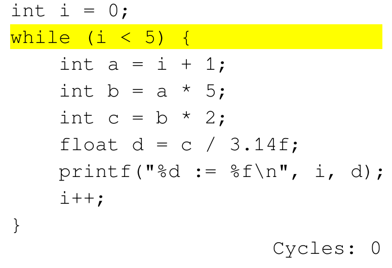

# Cycle Sim

"Runs" a program and shows how long each statement takes to run. The program 
is represented in a special CSV format describing the cycle-counts and next PC 
of each statement. Running the program creates a GIF that highlights each line
of code as it "runs" and displays the total cycle count.



# Install

First, install the requirements: 

```bash
python -m pip install tqdm pillow 
```

Then, run the program on a given data file (i.e., [programs/for-arithmetic.csv](programs/for-arithmetic.csv)).

```bash
python main.py programs/for-arithmetic.csv
```

The result is a GIF file named `result.gif`.
